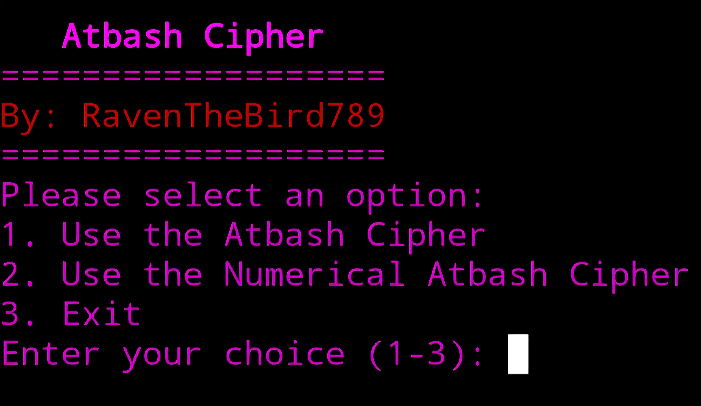

# Atbash-Cipher 🔐
Python script for an Atbash Cipher to show basic cryptography and decryption with both letters and numbers

Installation
* To download, simply type "git clone https://github.com/RavenTheBird789/Atbash-Cipher" in your command line within your terminal

Execution
* To run, simply type "python3 main.py" in your command line within your terminal or a shortcut can be created in a terminal session using the bash alias command to run the program faster. (Ex: alias run="python3 main.py")

Global Execution (Optional)

* Alternatively, you can run the program globally by simply typing "atbash" from anywhere in your terminal, follow these steps (For macOS and Linux):
  1. Make the file executable by typing "chmod +x main.py" in your terminal
  2. Copy the file to a new name using "cp main.py atbash" then make that executable too with "chmod +x atbash"
  3. Create a local bin folder if you don't already have one using "mkdir -p ~/.local/bin"
  4. Move the file into it using "mv atbash ~/.local/bin/"
  5. Make sure that folder is in your PATH by adding "export PATH="HOME/.local/bin:PATH"" to your ~/.bashrc (or ~/.zshrc if you use zsh)
  6. Reload your terminal config using "source ~/.bashrc" (or ~/.zshrc)
  7. Type "atbash" from anywhere to run the program

* For Windows
  1. Make sure Python is added to your PATH (check by typing "python --version" in Command Prompt. If it shows a version number, you're set)
  2. Create a folder to hold your global scripts, such as "C:\Scripts" (You can make this anywhere, just don't forget the path)
  3. Copy "main.py" into that folder and rename the copy "atbash.py"
  4. In the same folder, create a new text file named "atbash.bat"
  5. Open "atbash.bat" in Notepad and add this single line "@python "%~dp0atbash.py" %*"
  6. Save and close the file
  7. Add your folder to your PATH: press the Windows key, search "Environment Variables", click "Edit the system environment variables", click "Environment Variables", under "User variables" select "Path", click "Edit", click "New", then paste in your folder path (e.g. "C:\Scripts")
  8. Click OK on all the windows to save
  9. Close and reopen Command Prompt or Powershell
  10. Type "atbash" from anywhere to run the program
